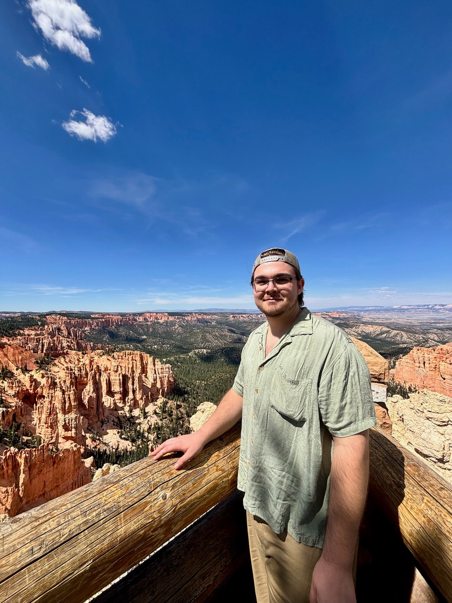
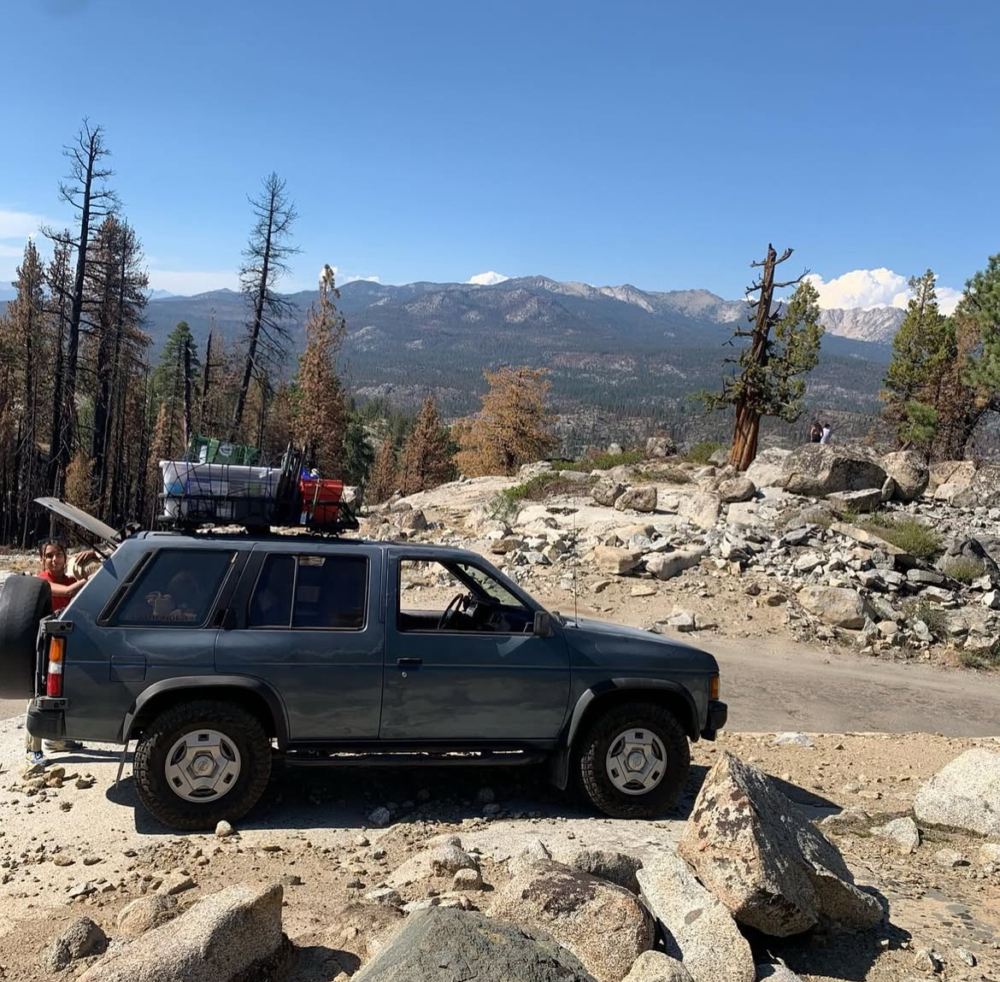
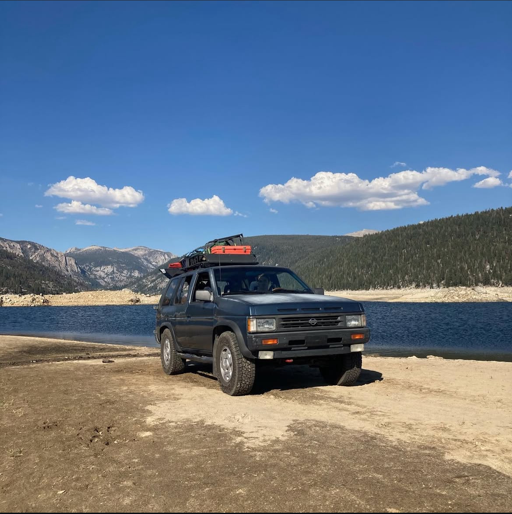
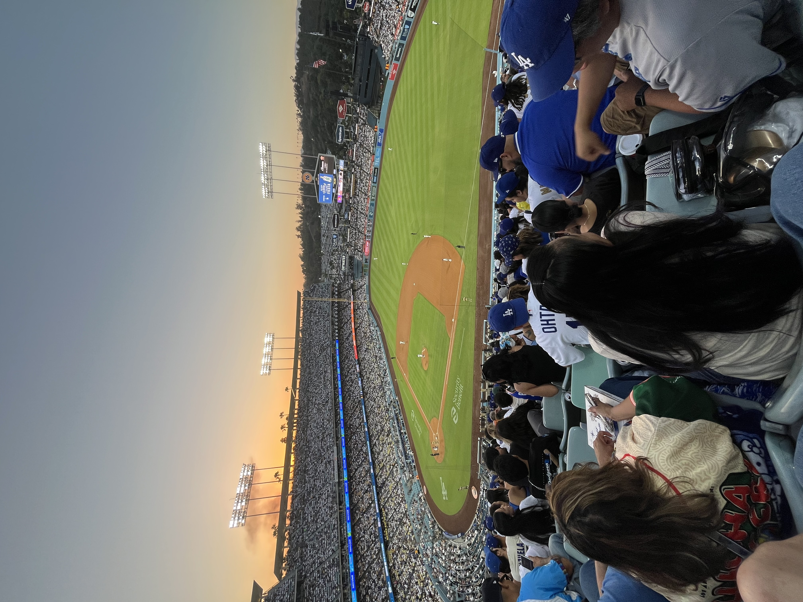

# The Great Outdoors!

Here is me on hike in the Colorado Rockies, I love being outdoors and getting in nature when I can!

### Highest 12,000ft of Elevation makes it hard to breath!

### Hoo-Doo Voo-Doo

Those figures of rock formations on my left are called *"Hoo-Doos."*\
The Indigenous peoples of Bryce Canyon, Utah – Southern Paiute – believed they were *evil* beings who could take the form of humans.
They also believed these beings were petrified by a coyote – a trickster – who turned them into stone after over-consuming the lands natural resources.

{fig-align="left" width="400"}

### Best Camping Bud

Couldn't ask for a better camping partner than Bubbles!

She's getting older now and probably doesn't have many trips left in her but boy is she in her element when shes out there.

# Cars & Trucks 

## WD21 Nissan Pathfinder

Keeping up with the theme of the great outdoors, my vehicle excels at getting past the crowds to the great outdoors.
It also excels at burning a hole in my wallet with it gas efficiency of a potato.
Its a stock 1991 Nissan Pathfinder that still running reliably strong!
I've learned to work on vehicles using this truck and I've kept up with all the maintenance and even done some bigger things to it myself.
It has been so incredibly well maintained that its rarely ever given me any real issues.
I guess its true what they say "they don't make em like they used to...."

# Baseball

## Go Dodgers!

